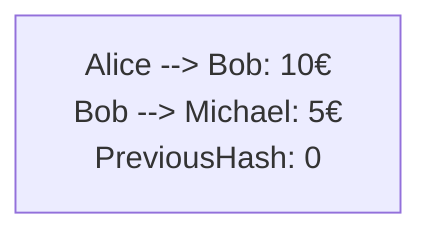
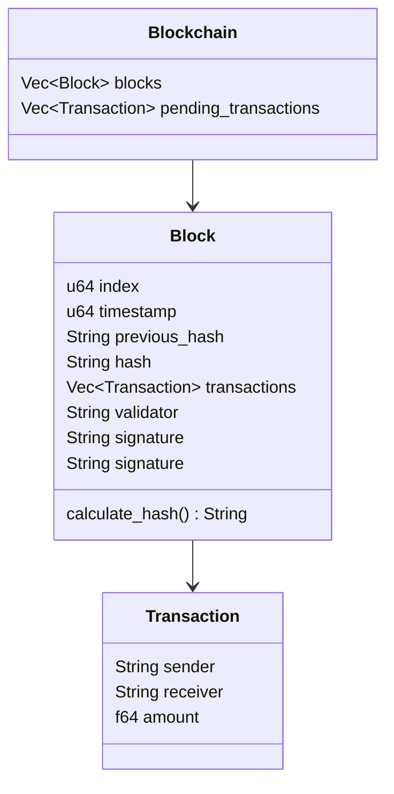

# FairMoney

Easily share your expenses with your friends, colleagues or any other group of your choice.

# Blockchain setup
Every group has a set of transactions saved in a blockchain. The genesis Block contains the first transactions made when creating the group. Proof of authority is required and shared with and edit link, not shared with a view link.

