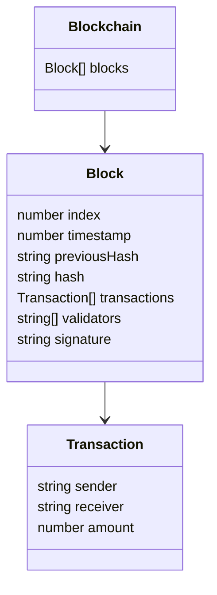

# FairMoney 💸

Easily share your expenses with your friends, colleagues or any other group of your choice.

---

This project is a distributed bill tracking program (similar to tricount, splitwise, ...). Instead of a classic client-server architecture Fairmoney uses P2P with the help of Blockchain.

(The distributed blockchain approach was only chosen for academic purposes and to maybe finally find something a blockchain is actually useful for.)

# Features 🧑‍🔧
- [ ] Creating a bill with multiple users and multiple transactions amongst those users.
- [ ] Have the portability to use multiple different browser entities
- [ ] Editing transactions and adding users after initially creating a bill.
  - Challenges are: Due to the nature of a blockchain editing a transaction after it is already part of a block is difficult. Possibly there is a need of reversing the transaction by artificially creating an inverse transaction.
- [ ] Sharing the bill with other participants of the bill
  - Challenges are: Sharing the bill requires P2P communication and has to somehow give access rights to the shared user. There is the possibility to include a new private key in the shared url that fits a validator. However, this makes links only usable once. The other possibility would be, to use only one keypair.

# Technical concepts ⛓️
When creating a new bill, a genesis block with a new blockchain is created for this specific group. One block contains some transactional data, as well as a list of validators, eligible of creating new blocks. The genesis block does only contain a public key and a signature of the creator of the bill.

This blockchain operates using PoA (proof of authority). The benefit of choosing PoA over other forms of verification is, that they also work reliably for small scale groups and do not require any resources in the already limited browser environment.